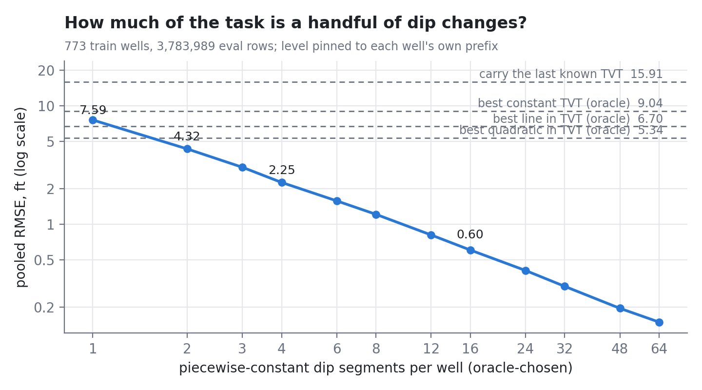
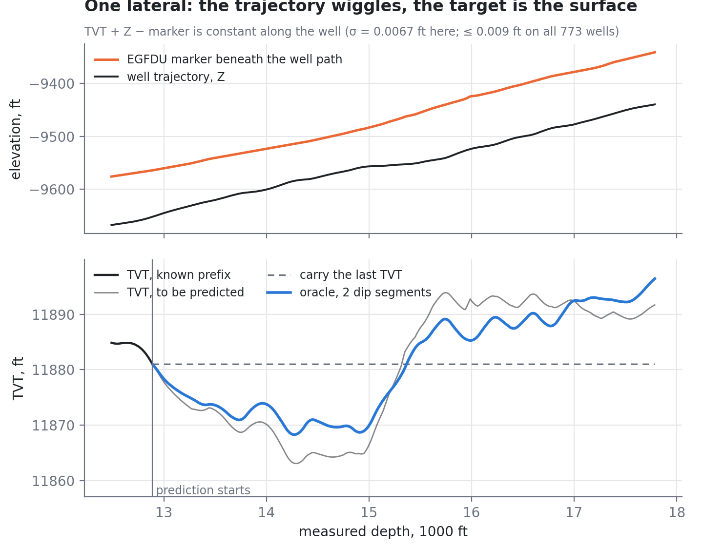
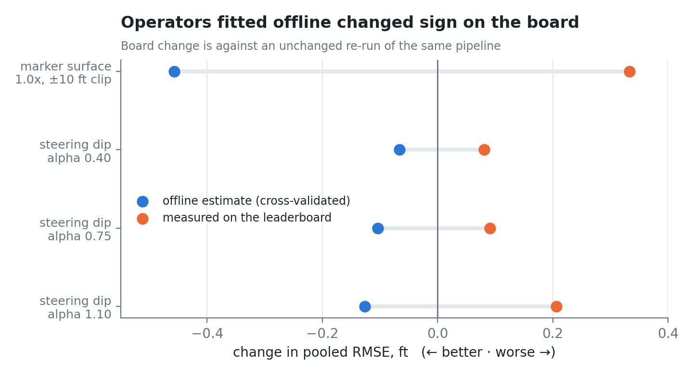
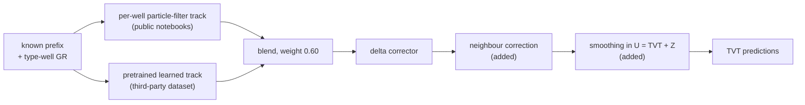

# Predicting stratigraphic position along a horizontal well

Notes, measurements and code from the [ROGII Wellbore Geology Prediction](https://www.kaggle.com/competitions/rogii-wellbore-geology-prediction)
competition on Kaggle: given the first part of a horizontal well, its gamma-ray log and a
nearby vertical reference well, predict the formation-relative depth (`TVT`) along the rest of the lateral.

The competition ended with a private score of **9.250 RMSE** against a best public score of **6.236**. That
gap is a large part of what this repository is about. It collects what turned out to be true about
the problem, what did not survive contact with held-out data, and what I would do differently.

<p align="center">
  <a href="https://www.kaggle.com/competitions/rogii-wellbore-geology-prediction">Competition</a> ·
  <a href="https://www.kaggle.com/competitions/rogii-wellbore-geology-prediction/data">Data</a> ·
  <a href="https://www.kaggle.com/competitions/rogii-wellbore-geology-prediction/leaderboard">Leaderboard</a> ·
  <a href="https://www.kaggle.com/competitions/rogii-wellbore-geology-prediction/discussion">Discussion</a> ·
  <a href="docs/FINDINGS.md">Findings</a> ·
  <a href="docs/NEGATIVE_RESULTS.md">Negative results</a>
</p>

<p align="center">
  
</p>

## The short version

1. **The target is an exact identity.** On all 773 training wells, `TVT + Z − marker(x, y)` is constant along the
   well to within 0.009 ft (the data are recorded at 0.05 ft). Everything the trajectory contributes is known;
   the whole problem reduces to predicting a *dip sequence* — how the formation surface tilts along the lateral.
2. **That sequence is short.** With the level pinned to each well's own prefix, an oracle that may choose only
   two piecewise-constant dips scores **4.32 ft**, better than an oracle quadratic fitted to TVT (5.34 ft) and
   below the best public leaderboard score I saw during the competition (4.86). Sixteen dips: 0.60 ft.
3. **Few signals can supply those dips.** Gamma ray over-fits when the search is flexible; neighbouring wells
   constrain the dip only coarsely; the well's own steering carries a weak signal (lagged correlation 0.24).
4. **Offline gains did not predict leaderboard gains.** Every operator fitted against offline residuals
   reversed sign on the board, in one case as a monotone strength ladder.
5. **The private set was harder and reordered the public ranking.** Configurations that were tuned for the
   public score did worst; the ones that had been de-tuned did best.

| | |
|---|---|
| Training wells / eval rows | 773 / 3,783,989 |
| Best public score (v17) | 6.236 |
| Private score of the submission | 9.250 |
| Private score of the best row that was *not* selected | 8.628 |

## Contents

- [What the problem is](#what-the-problem-is)
- [Findings](#findings)
- [Measurement lessons](#measurement-lessons)
- [Outcome](#outcome)
- [Reproducing the analyses](#reproducing-the-analyses)
- [Repository layout](#repository-layout)
- [What is and is not original](#what-is-and-is-not-original)

## What the problem is

A horizontal well is drilled sideways through a thin rock layer. The geologist steers it by comparing the
gamma-ray (GR) log with a vertical *type well*. For every row after a *prediction start*, the task is to
output `TVT`, the stratigraphic position of the bit. Scoring is pooled RMSE over every hidden row
(about 200 hidden wells).

Because `TVT + Z` is the shape of the formation surface (see below), predicting TVT is the same as predicting
how that surface tilts under the lateral.

<p align="center">
  
</p>

*Top: the well's trajectory and the marker surface beneath it. Bottom: the TVT to be predicted, the
carry-the-last-value baseline, and the best two-segment dip path.
The trajectory term is free; only the dips are unknown.*

## Findings

Numbers marked ✓ are regenerated by the scripts in this repository from the competition data
(`results/`). The others were measured during the competition with code that depends on third-party
artifacts; they are described in [`docs/FINDINGS.md`](docs/FINDINGS.md) and are labelled as such.

### 1. `U = TVT + Z` is the formation surface, exactly ✓

For each of the six marker columns, `U(md) = TVT + Z = marker(X, Y) + C_well` holds with a within-well standard
deviation of at most 0.009 ft on every well, and the six markers are mutually conformal
(`scripts/04_verify_identity.py`). The marker polylines are drawn by a person, with roughly 15–25 change points per well (recorded during the
competition), so the target is piecewise linear with few kinks, not a smooth curve.

### 2. The task is a dip sequence ✓

Anchoring the prediction on the last known row,

    TVT_i = TVT_anchor − (Z_i − Z_anchor) + Σ_{j ≤ i} dip_j · ΔMD_j

so the entire uncertainty is in the dips (`scripts/03_dip_ladder.py`):

| oracle chooses… | pooled RMSE (ft) |
|---|---|
| nothing — carry the last TVT | 15.91 |
| best constant / line / quadratic in TVT | 9.04 / 6.70 / 5.34 |
| **1 / 2 / 3 / 4 dip segments** | **7.59 / 4.32 / 3.02 / 2.25** |
| 8 / 16 / 32 segments | 1.21 / 0.60 / 0.30 |

This is a ceiling for an *oracle*, not a method. Its use is to say what any model has to be able to resolve:
two or three dip changes per well.

### 3. Error is accumulated drift, and it lives at long wavelengths

Measured on an honest out-of-fold reconstruction of the pipeline: RMSE grows with measured-depth distance `d` (ft) from the anchor as
`√(2.00² + (0.0513·d^0.654)²)`, and the split into level / trend / residual is 0.62 / 0.19 / 0.19, close to the
exact Brownian-motion values 2/3, 1/5, 2/15. About 99% of the error energy is at wavelengths above 500 ft. So
the "level" error is not a per-well offset that a better anchor would remove, and a post-processing filter has
little to find. Smoothing is worth doing in `U`, not in `TVT`: smoothing `TVT` removes the anti-correlated
wiggle that the trajectory puts into it.

### 4. Gamma ray ranks; it does not generate ✓ (partly)

- With a flexible dynamic program, the GR log is fitted *better than the ground truth* on 72% of wells, and
  the resulting path scored 15.83 against 13.91 for carrying the last value (140 held-out wells, recorded).
- With no fitting at all and the path restricted to `K` dip segments, the true path is scored against 200
  impostors of the same complexity (`scripts/07_gr_identifiability.py`, 120 wells): truth beats **83% (K=1),
  87% (K=2), 93% (K=4)** of them; against impostors drawn tightly around the truth's own slope, 68%.
- A total-variation dip DP recovers a synthetic two-segment path to 0.25 ft, but scores 30.3 on real wells:
  the likelihood can *rank* a small set of candidates, but its argmin over a large space is far from truth.
- Label-free GR re-ranking of five real candidate tracks was right 61–63% of the time per pair, and still
  did not improve the blend: the value of a selection and the accuracy it needs both scale with how far apart
  the candidates are, and they cancel.

### 5. Neighbours and steering help less than they seem

- Whether cross-well features transfer depends on whether hidden wells have training neighbours. Under a
  simulated random 20% hold-out the nearest remaining well is a median **411 ft** away; under whole-pad hold-out
  645 ft; if a spatial block is held out, 31,097 ft ✓ (`scripts/06_holdout_geometry.py`).
- The surface's `dU/dMD` correlates with the trajectory's `dZ/dMD` at 0.24, peaking when the trajectory is read
  150 ft *ahead*, consistent with a steering delay ✓ (`scripts/05_steering_lag.py`). The signal is real and small.

### 6. The sign of an offline gain was not a usable forecast

<p align="center">
  
</p>

See [Measurement lessons](#measurement-lessons).

## Measurement lessons

These are the part I would most want a reader to take away.

- **Operators fitted on a harness residual reversed on the board.** The marker-surface correction measured
  −0.46 ft offline and cost +0.33 ft (clipped) to +1.44 ft (unclipped). A steering-dip operator, shipped as a
  three-point strength ladder, measured −0.07 / −0.10 / −0.13 offline and +0.08 / +0.09 / +0.21 on the board:
  monotone in strength, so not noise. The offline harness measured a pipeline about 1.45 ft worse than the one
  that was deployed (7.73 vs about 6.28), so its residual was the wrong target.
- **Leave-spatial-out had already said so.** The surface operator's gain went to zero under
  leave-spatial-block-out. I argued the split was the wrong analogue and shipped anyway. A measurement beat a
  chain of reasoning, and I overrode it.
- **A pipeline made of fitted parts has a fixed point.** 22 of 22 single-knob probes on 13 axes landed at or
  above the family mean. That was not a tuned optimum: downstream components (a delta corrector, calibrations,
  stack coefficients) were fitted at the incumbent configuration, so any single change breaks a calibration and
  loses by construction. A probe in such a pipeline measures calibration breakage, not the axis.
- **A third-party component fitted on all training wells leaks, and nothing offline can see it.** The learned
  track scored 5.6 out of fold and an estimated 7.8 on hidden wells. Fitting the blend weight offline pushed it to a
  negative value that looked excellent (5.45) and scored worst on the board (6.99, versus 6.42 at the
  public weight 0.60). I had inferred the component's quality from a blend that down-weighted it, so the
  measurement could not distinguish the hypotheses.
- **Estimate noise from the ensemble, not from one pair.** The run-to-run σ of the same configuration was
  first taken as 0.058 from a single pair and was later 0.033 from seven clean rows; occasional larger jumps remained unexplained. A hypothesised datum-mode flip
  was tested directly and rejected (0 in 21,120 re-weighted runs).
- **Test any new metric on a known-positive.** A re-weighted offline metric retro-predicted two reversals and
  then called the one component known to help (a prefix calibration worth about 1 ft on the board) harmful.

## Outcome

| submission | description | public | private |
|---|---|---|---|
| v17 | public-optimal configuration (submitted) | 6.236 | **9.250** |
| v18 | stacked variant (submitted) | 6.295 | 9.343 |
| v28 | conservative visible-prefix profile (not selected) | 7.030 | **8.628** |

The private set was about 2.6 RMSE harder than the public one, and it **inverted** the public ordering.
Every configuration that had been calibrated to the public-like distribution lost on private wells, and the
variants that de-tuned or regularised those calibrations transferred best. The public board was therefore not
only noisy; it was calibrated to the same distribution as the pipeline and selected *against* generalisation.
The selection rules were followed correctly on the information available, and the best private row was left
unpicked.

What I would do next time: treat a public-to-private shift as the default in spatial, geological tasks;
spend one of the two final slots on a maximally regularised variant whatever its public read; and judge a
private score against the field's shift as well as against one's own.

## Reproducing the analyses

Competition data are not redistributed here. With the Kaggle CLI:

```bash
kaggle competitions download -c rogii-wellbore-geology-prediction -p data
unzip data/rogii-wellbore-geology-prediction.zip -d data      # gives data/train, data/test, ...
pip install -r requirements.txt
export ROGII_DATA=$PWD/data                                   # or leave it in ./data
```

| script | result |
|---|---|
| `scripts/01_audit_data.py` | data checks (prefixes contiguous, 1 ft steps, no gaps) → `results/audit.txt` |
| `scripts/02_oracle_ladder.py` | constant / line / quadratic oracles → `results/oracle_ladder.json` |
| `scripts/03_dip_ladder.py` | the dip-segment oracle ladder, about 2 minutes → `results/dip_ladder.json` |
| `scripts/04_verify_identity.py` | `TVT + Z = marker + C` on 773 wells → `results/identity.json` |
| `scripts/05_steering_lag.py` | trajectory-to-surface lag correlation → `results/steering_lag.txt` |
| `scripts/06_holdout_geometry.py` | pads and nearest-neighbour distance under hold-out → `results/holdout_geometry.txt` |
| `scripts/07_gr_identifiability.py` | truth versus same-complexity impostors under a GR likelihood → `results/gr_identifiability.txt` |
| `scripts/08_make_figures.py` | the figures in `figures/` |

## Repository layout

```
.
├── README.md
├── docs/
│   ├── FINDINGS.md           the longer write-up, with provenance of every number
│   └── NEGATIVE_RESULTS.md   what was tried and why it did not work
├── figures/                  generated by scripts/08_make_figures.py
├── results/                  outputs of the scripts (JSON / text) + two small hand-entered tables
├── rogii/                    data loading, metric, oracle baselines
├── scripts/                  one script per measurement above
├── requirements.txt
└── LICENSE
```

## What is and is not original



*Simplified view of the submitted pipeline. The two upstream tracks and the blend come from the public
notebooks; the neighbour correction and the choice to smooth in `U` were added here.*

The submitted pipeline was built on the public community notebooks for this competition, which combine a
per-well particle-filter track with a pretrained learned track from a third-party dataset. I did not
write those parts and they are not included. What this repository contains is my own analysis of the problem and
of the pipeline's behaviour, and the operators I added and tested on top of it (a distance-gated neighbour
correction, U-space smoothing, and the operators in `docs/NEGATIVE_RESULTS.md`).

Thanks to the organisers for the data and to the participants whose public notebooks and discussions made the
baseline accessible.
